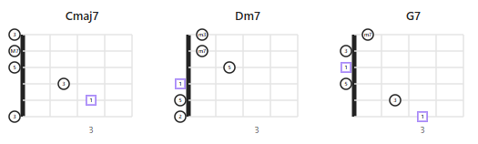
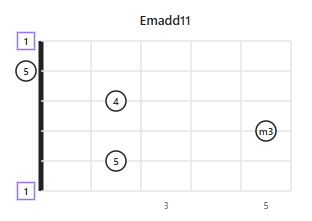
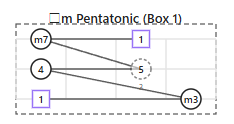
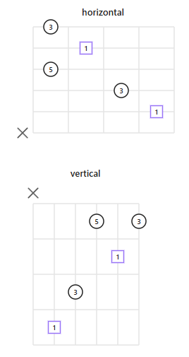

# Fretboard Renderer

*[日本語 README](README.ja.md)*

Render guitar fretboard diagrams as SVG in your Obsidian notes, from a lightweight YAML syntax inside fenced code blocks. From analyzing chord progressions to checking pentatonic/mode positions, the goal is clean-looking diagrams with minimal typing.



## Getting started

### Install

Open Settings → Community plugins → Browse, search for **"Fretboard Renderer"**, and install it. (Or see [Development](#development) below to run it from source.)

### Your first diagram

Add a fenced code block with the language set to `fretboard`, and list the notes you want to show — that's the only required part:

````markdown
```fretboard
notes:
  - {s: 6, f: 0, label: root}
  - [5, 2]
  - [4, 5]
  - [3, 2]
  - [2, 0]
  - [1, 0]
```
````



`s` is the string number (1 = highest-pitched string) and `f` is the fret (`0` = open, `x` = muted). Marking one note `label: root` is enough for the plugin to work out the chord name and highlight every note that shares that root, automatically.

## Feature highlights

### Automatic root highlighting & degree labels
Mark any note `label: root` and the plugin computes each note's interval (1, b2, 2, m3, 3, ...) relative to it, and highlights notes sharing the root's pitch (including other octaves) with a different shape/color — no manual styling needed.

### Absolute or relative (movable) diagrams
Give a `startFret` (or use an open string) for a real, fixed-position chord name like `Cmaj7`. Omit it for a movable pattern — the plugin infers the position and labels it generically (`□...`) instead, since the same shape means a different chord depending on where you play it. `boxes` and `paths` pair well with relative mode, for outlining a scale position and tracing a run through it:



### Name a chord or a scale
By default the auto-generated title names a chord/arpeggio (e.g. `Am7add11`) — the same notes read as a scale would be called something else (e.g. minor pentatonic). Switch **Naming mode** to `scale` (Settings, `fretboard-renderer.yaml`, or `namingMode: scale` on one diagram) and the title always names the best-fitting scale instead (e.g. `A Minor Pentatonic`, or `□ Minor Pentatonic` for a movable pattern) — handy for reverse-engineering a copied phrase/solo against its backing chord's root. Any note that doesn't fit the matched scale is called out as a passing note, e.g. `A Minor Pentatonic (+2)`, and ghosted on the diagram. See [Naming mode](#naming-mode-chord-vs-scale) in the reference for the full scale list and how the best fit is chosen.

### Accurate chord names: sus, add, tensions, slash chords
The auto-generated title infers real chord theory, not just root + basic quality: `sus2`/`sus4`/power chords when there's no 3rd, `add9`/`add11` when there's no 7th, folded dominant tensions (`C9`, `C11`, `C13`) vs. parenthesized ones on `maj7`/`m7` (`Cmaj7(9)`), `6`/`6/9`, and a `/bass` suffix when the lowest-sounding note isn't the root (`Cmaj7/E`, or `□m7/bVII` in relative mode). Switch the notation itself — pop **Standard**, **Berklee**, or **Jazz** (Real Book) — with **Chord symbol style** (Settings, `fretboard-renderer.yaml`, or `chordSymbolStyle` on one diagram). See [Chord symbol style & advanced inference](#chord-symbol-style--advanced-inference) for the full rules.

### Multiple diagrams side by side
Use `diagrams:` to lay out several charts in one block — handy for a progression like Cmaj7 → Dm7 → G7 — without fighting Obsidian's block layout:

````markdown
```fretboard
diagrams:
  - {title: Cmaj7, startFret: 0, size: 0.6, notes: [{s: 5, f: 3, label: root}, [4, 2], [3, 0], [2, 0]]}
  - {title: Dm7, startFret: 0, size: 0.6, notes: [{s: 4, f: 0, label: root}, [3, 2], [2, 1], [1, 1]]}
  - {title: G7, startFret: 0, size: 0.6, notes: [{s: 6, f: 3, label: root}, [5, 2], [4, 0], [3, 0], [2, 0], [1, 1]]}
```
````

### Horizontal or vertical orientation
Switch the whole vault (Settings, or a vault-wide `fretboard-renderer.yaml`), or just one diagram with `orientation: vertical`.



### Fine control when you need it
Per-note `color`, `fillStyle`, `sizeAdjust`; barres, boxed scale positions, dot-to-dot paths, custom tuning, note-name vs. degree labels, and more — see [Reference](#reference) below.

## Configuration, in brief

Settings are layered in three tiers, each overriding the last: **Local** (this block's YAML) > **Global** (a `fretboard-renderer.yaml` file at the vault root, for vault-wide defaults) > **System** (the plugin's Settings tab, for install-wide defaults). Most people only ever need Local (in the code block) and the Settings tab — Global is there for when you want one vault-wide look without repeating YAML in every note. Full details in [Reference](#reference).

---

## Reference

Everything below is the complete option reference — skip to whatever you need.

### Configuration layers (System / Global / Local)

Configuration is layered in three tiers, **each one overriding the last**:

```
Local (YAML inside a single ```fretboard block)
  ↑ overrides
Global (fretboard-renderer.yaml at the vault root)
  ↑ overrides
System (the plugin's Settings tab)
```

| Layer | Defined in | Scope |
| :--- | :--- | :--- |
| **System** | Obsidian's Settings tab for this plugin | Fallback for every ```fretboard block in the vault |
| **Global** | `fretboard-renderer.yaml` at the vault root | Every ```fretboard block in that vault |
| **Local** | YAML inside each ```fretboard code block | That one block only |

#### System (Settings tab)

Change these under Settings → Fretboard Renderer. They're the defaults for every diagram in the vault. The settings tab is organized into four sections: "Layout & dimensions", "Display & style", "Note appearance", and "Tuning & fallback".

| Setting | Values | Default |
| :--- | :--- | :--- |
| Orientation | `horizontal` / `vertical` | `horizontal` |
| Strings | Number of strings | `6` |
| Fret count | Fret width to draw | `4` |
| String spacing | Spacing between strings (px) | `30` |
| Fret spacing | Spacing between frets (px) | `50` |
| Label mode | `interval` (degree) / `note` (note name) / `none` | `interval` |
| Accidental | `sharp` (#) / `flat` (b) | `sharp` |
| Naming mode | `chord` (name a chord) / `scale` (name a scale, see [below](#naming-mode-chord-vs-scale)) | `chord` |
| Chord symbol style | `standard` / `berklee` / `jazz`, see [below](#chord-symbol-style--advanced-inference) | `standard` |
| Omit notation | On/off toggle — marks a chord missing an expected tone, e.g. `C(omit3)`, `G7(omit3)`, `(omit5)`. Off by default (guitarists very commonly omit the 5th — marking every such chord would be noisy). See [below](#chord-symbol-style--advanced-inference) | Off |
| Show inversions | On/off toggle — shows the slash bass when it's just an inversion (the chord's own 3rd, 5th, or 7th as the lowest note, e.g. `C/E`). Off by default (real-world chord charts very often skip notating this). See [below](#chord-symbol-style--advanced-inference) | Off |
| Default shape | `circle` / `square` / `triangle` / `none` (no outline, label only — see [below](#notes-required)) | `circle` |
| Fill style | `filled` / `outlined` | `outlined` |
| Nut style | `thick` / `double` | `thick` |
| Fret numbering | `all` / `dotted` (only fretted columns) / `inlay` (standard inlay positions: 3,5,7,9,12,15,17,19,21,24,...) / `none` | `inlay` |
| Default tuning | Comma separated, lowest string first | `E,A,D,G,B,E` |
| Omitted string behavior | `open` (treat as f:0) / `muted` (treat as f:x) / `none` (draw nothing) | `open` |
| Note size (px) | Base radius of each note dot; a note's `sizeAdjust` (-5..5) is added to this | `10` |
| Label font size (px) | Base font size for note labels; a note's `labelSizeAdjust` (-5..5) is added to this | `10` |

`Label mode: note` only shows note names in **absolute mode** (`startFret` given, or an explicit open string `f: 0` present). In relative/movable mode (`startFret` omitted and no open string), the actual notes depend on where the shape is played, so `note` mode shows no automatic label either (interval labels are unaffected, since the same relationship holds wherever the shape is played).

#### Global (vault-wide YAML config file)

Create a file named **`fretboard-renderer.yaml`** at the vault's **root** (not inside `.obsidian/`) to override System values for the whole vault. It accepts the same keys as the System table above.

```yaml
# <vault root>/fretboard-renderer.yaml
orientation: vertical
fretCount: 5
labelMode: note
```

- Any key that's absent, or if the file doesn't exist, falls back to the System value.
- Saving the file takes effect on the next render — no need to reload the plugin.
- A syntax error shows a one-time Obsidian notice and falls back to System settings (it won't break every diagram in the vault).

#### Local (YAML inside each ```fretboard block)

Write this directly inside each note's ```fretboard code block. It has the highest priority, overriding both System and Global. Only `notes` is required.

When `startFret` is given, fret numbers in `notes`/`boxes`/`paths`/`barre` are relative to position 1 (see [`startFret`](#other-local-options-all-optional) below) — so this exact block plays the same shape starting anywhere on the neck just by changing `startFret`:

```fretboard
title: Am Pentatonic (Box 1)
visible: 1-6
startFret: 5
frets: 4
boxes:
  - {frets: "1-4", style: dashed}
paths:
  - [[6,1], [6,4], [5,1], [5,3]]
notes:
  - {s: 6, f: 1, label: root, shape: square}
  - [6, 4]
  - {s: 5, f: 1}
  - {s: 5, f: 3, finger: 3, ghost: true}
```

##### `notes` (required)

An array of note placements. Both object form and a positional shorthand array are accepted.

```yaml
notes:
  - {s: 6, f: 1, label: root, shape: square, finger: 1, ghost: false, class: "highlight"}
  - [6, 4]              # [s, f]
  - [5, 1, "root"]       # [s, f, label]
  - [5, 3, "3", "square", 3]  # [s, f, label, shape, finger]
  - {s: 4, f: 3, color: red, fillStyle: outlined, sizeAdjust: -3, labelSizeAdjust: 2}
```

| Key | Required | Description |
| :--- | :--- | :--- |
| `s` | Yes | String number (1..N, 1 is the highest-pitched string) |
| `f` | Yes | Fret number. `0` = open, `1`+ = fretted, `x` = muted. **`0` and `x` are not grid columns** — they're always drawn in a special header lane outside the grid, and are never counted as fret-number labels |
| `label` | – | `root` auto-computes the interval degree. Any other string (e.g. `"maj7"`, `"9"`) is shown verbatim, bypassing auto-calculation |
| `shape` | – | `circle` / `square` / `triangle` / `none` — draws no outline, just the label (or finger number, or any value that would otherwise sit inside the shape). Still rendered as a borderless filled circle underneath — with or without a label — so it isn't literally invisible and text doesn't collide with the fret/string line behind it |
| `finger` | – | Finger number, printed small just outside the dot |
| `ghost` | – | `true` draws a dashed/translucent outline |
| `virtual` | – | `true` marks this as a reference pitch, not an actually-fretted/sounding note — see [Virtual notes](#virtual-notes) below |
| `class` | – | Arbitrary CSS class name, for highlighting via a CSS snippet |
| `color` | – | CSS color for just this note (`red`, `#ff0000`, `var(--color-red)`, ...). Overrides System/Global fill style and the root-highlight color |
| `fillStyle` | – | `filled` / `outlined`. Overrides System/Global `Fill style` for just this note |
| `sizeAdjust` | – | Integer -5..5. Nudges just this note's dot size (px) from `Note size` |
| `labelSizeAdjust` | – | Integer -5..5. Nudges just this note's label font size (px) from `Label font size` |

`color`, `fillStyle`, `sizeAdjust`, `labelSizeAdjust`, and `virtual` are only available in object form (`{s: ..., f: ...}`) — not in the `[s, f, label, shape, finger]` shorthand array.

Notes highlighted as the root (same pitch class as the `label: root` note, including octaves) use the System accent color by default (Obsidian's `--interactive-accent` theme variable, typically purple/blue) — this is intentional default behavior. Use `color` above to override the color of any specific note, e.g. to make it red.

##### Other Local options (all optional)

| Key | Type | Description |
| :--- | :--- | :--- |
| `title` | String | Title printed above the diagram. Auto-generated if omitted (see below) |
| `startFret` | Number | Leftmost fret number of the grid. Omitting it switches to relative mode (see below). When given, every other fret number in the block (`notes`, `boxes`, `paths`, `barre`) is read as relative to position 1 and transposed: `absolute = f + max(startFret, 1) - 1`. `0` (open) and `x` (muted) are never transposed. This is a no-op for `startFret: 0` or `1`, so plain fixed-position chords written with real fret numbers are unaffected |
| `frets` | Number | Fret width to draw (overrides System `Fret count` for this diagram only). If omitted, the grid auto-expands past `Fret count` when needed so no fretted note is clipped — an explicit value is never auto-expanded |
| `orientation` | `horizontal` / `vertical` | Overrides orientation for this diagram only |
| `namingMode` | `chord` / `scale` | Overrides [Naming mode](#naming-mode-chord-vs-scale) for this diagram's auto-generated title only |
| `chordSymbolStyle` | `standard` / `berklee` / `jazz` | Overrides [Chord symbol style](#chord-symbol-style--advanced-inference) for this diagram's auto-generated title only |
| `omitNotation` | Boolean | Overrides Omit notation for this diagram's auto-generated title only — see [Chord symbol style & advanced inference](#chord-symbol-style--advanced-inference) |
| `showInversions` | Boolean | Overrides Show inversions for this diagram's auto-generated title only — see [Chord symbol style & advanced inference](#chord-symbol-style--advanced-inference) |
| `size` | Number | Overall scale for this diagram (e.g. `0.6` = 60% size). Useful for fitting several small diagrams together |
| `fretSpacingAdjust` | Integer -5..5 | Pixel nudge to fret spacing, applied before `size` |
| `stringSpacingAdjust` | Integer -5..5 | Pixel nudge to string spacing, applied before `size` |
| `visible` | String | Range of strings to draw, e.g. `"1-4"` |
| `barre` | Array | `{fret, start, end}` — draws a barre marker |
| `boxes` | Array | `{frets: "5-8", strings: "1-6", style: "dashed"}` — outlines a scale position or similar |
| `paths` | Array | `[[6,5],[6,8],[5,5]]` — connects dots with a line |

`size` / `fretSpacingAdjust` / `stringSpacingAdjust` (whole diagram) and each note's `sizeAdjust` / `labelSizeAdjust` exist so you can fine-tune appearance from a note's YAML instead of editing the plugin's own `styles.css` — that file isn't meant to be edited by users. Fine-grained color is likewise handled per-note via `color`, not CSS.

### Absolute mode vs. relative mode

- **Absolute mode:** `startFret` is given, or — even without it — `notes` contains an explicit open string (`f: 0`), since a shape with an open string can't physically be moved up the neck. Generates a real chord name (e.g. `Cmaj7`), and only draws the nut (thick/double line) when the left edge is truly fret 0.
- **Relative mode:** `startFret` is omitted and no open string is present. Treated as a movable pattern: the leftmost fret is set automatically to the lowest fretted note (excluding 0 and x), no fret numbers are printed, and a relative chord name is generated (e.g. `□maj7`).

When `startFret` is given explicitly, every other fret number in the block (`notes`, `boxes`, `paths`, `barre`) is read as relative to position 1 and transposed: `absolute = f + max(startFret, 1) - 1`. `0` (open) and `x` (muted) are never transposed. This is a no-op for `startFret: 0` or `1`, so a plain fixed-position chord written with real fret numbers is unaffected — but for anything higher, it means the same `notes` block plays the same shape starting anywhere on the neck just by changing `startFret` (see the [Local](#local-yaml-inside-each-fretboard-block) example above).

### Interval auto-calculation and root highlighting

Marking any note with `label: root` auto-computes each note's interval degree (`1, b2, 2, m3, 3, 4, b5, 5, m6, 6, m7, M7`) relative to the tuning, and shows it when label mode is `interval`. Notes matching the root's pitch class (including other octaves) are automatically highlighted (different shape and/or color).

Two display-only adjustments on top of that degree list: the root itself is printed as **`R`**, not `1` — finger numbers already use `1`–`4` on the diagram, and the two easily get confused. And when the surrounding chord is recognized as diminished (a minor 3rd + flatted 5th, no other 7th), the note that would otherwise show `6` — 9 semitones from the root, enharmonic with a diminished 7th's `bb7` — is printed as **`bb7`** instead, since that's the reading that actually matches the chord. Neither of these touches the chord title logic or scale matching below, which both keep using the plain `1`/`6` degrees internally.

This calculation can't distinguish tensions beyond one octave — e.g. a 9th looks the same as a 2nd, an 11th the same as a 4th. To show them correctly, override a note's `label` (e.g. `label: "9"`) or the diagram's `title` (e.g. `title: Cmaj9`) explicitly.

### Naming mode (chord vs. scale)

The same set of notes can be read two ways: as a chord/arpeggio (e.g. `Am7add11`), or — useful when you've copied a played phrase/solo onto the diagram and marked its backing chord's root — as the scale it most likely came from. **Naming mode** controls which one the auto-generated title uses:

- **`chord`** (default): names the chord/arpeggio, same as before.
- **`scale`**: reverse-engineers the best-fitting scale for the notes present, even when they don't exactly match one — it always commits to its best guess rather than falling back to a chord name. Notes outside the matched scale are reported as passing notes in parentheses, e.g. `A Minor Pentatonic (+2)` (or `□ Minor Pentatonic (+2)` in relative mode; no suffix at all on an exact match), and rendered ghosted on the diagram — same look as a manually-marked `ghost: true` note — so they're easy to spot at a glance.

Set it in Settings, in `fretboard-renderer.yaml` for the whole vault, or per diagram with `namingMode: scale`.

**How the best fit is chosen:** for each scale below, its score is +1 for each of its own notes that's present in the input, -1 for each that's missing, and **-1 for each present note it *doesn't* contain** (an outlier/passing-note candidate). The highest-scoring scale wins, ties favor the smaller/simpler one. Penalizing outliers matters: without it, a scale that leaves one note unexplained (e.g. minor pentatonic + a stray 2nd, reported as `(+2)`) could tie with — and by the size tie-break, beat — a scale that explains that same note as one of its own (e.g. Dorian, which contains that 2nd), even though the latter is clearly the tighter fit. With the penalty, Dorian wins outright. This still guarantees an exact match always wins outright — nothing can score higher, since any bigger superset loses points for its own unplayed notes and any smaller subset loses points for the notes it leaves as outliers.

- **`scaleAnalyze: true`** (local-only, off by default): instead of just the #1 pick, stacks the **top 5** ranked candidates as separate title lines (`1. E Dorian`, `2. E Aeolian (Natural Minor)`, ...) — useful for comparing close calls rather than committing to a single guess.

Covers standard Western scale families plus the Japanese Hirajoshi and Ryukyu pentatonic families, each expanded to *every* rotation/mode, not just the traditionally-named ones — since the root here is always the one you assign, the same collection of notes read from a different root is a different row in this table:

| Category | Scales |
| :--- | :--- |
| Pentatonic (5 rotations) | Major Pentatonic, Minor Pentatonic, Suspended Pentatonic (Mode 2), Phrygian Pentatonic (Mode 3), Mixolydian Pentatonic (Mode 4) |
| Dominant Pentatonic (5 rotations) | Dominant Pentatonic (Modes 1–5) |
| Japanese pentatonic — Hirajoshi family (5 rotations) | Hirajoshi, Iwato (Hirajoshi Mode 2), Hon-Kumoi-joshi (Hirajoshi Mode 3), In Sen / Kumoi / Miyakobushi (Hirajoshi Mode 4), Lydian Pentatonic / Chinese (Hirajoshi Mode 5) |
| Japanese pentatonic — Ryukyu family (5 rotations) | Ryukyu, Ryukyu (Mode 2), Ryukyu (Mode 3), Hindu Pentatonic (Ryukyu Mode 4), Ryukyu (Mode 5) |
| Diatonic modes (7 rotations) | Ionian (Major), Dorian, Phrygian, Lydian, Mixolydian, Aeolian (Natural Minor), Locrian |
| Melodic minor (7 rotations) | Melodic Minor, Lydian Dominant, Altered (Super Locrian), Half-Diminished (Locrian ♮2), Dorian b2, Lydian Augmented, Mixolydian b6 |
| Harmonic minor (7 rotations) | Harmonic Minor, Phrygian Dominant, Locrian ♮6, Ionian #5, Dorian #4, Lydian #2, Ultralocrian (Altered Diminished) |
| Harmonic Major (7 rotations) | Harmonic Major (Modes 1–7) |
| Double Harmonic Major (7 rotations) | Double Harmonic Major (Modes 1–7) — aka Byzantine/Arabic/Gypsy Major scale |
| Neapolitan Major (7 rotations) | Neapolitan Major (Modes 1–7) |
| Symmetrical | Whole Tone (only 1 unique rotation), Augmented (2), Diminished Whole-Half / Half-Whole (2) |
| Bebop (8 rotations each) | Bebop Dominant (Modes 1–8), Bebop Major (Modes 1–8) |
| Other | Blues, Major Blues |

For the newer families above (Harmonic Major, Double Harmonic Major, Neapolitan Major, Dominant Pentatonic), only the well-attested parent-scale name is used — derived-mode nicknames vary too much across sources to assert confidently, so modes 2+ are labeled generically (`Harmonic Major (Mode 2)`, etc.) rather than risk a wrong nickname. "In Sen" (陰音階) turned out to share its exact note collection with an existing Hirajoshi rotation, so it's folded into that row's name instead of listed separately.

Other traditional Japanese scales (miyako-bushi, inaka-bushi, ritsu, min'yo, ...) aren't included yet.

### Chord symbol style & advanced inference

Beyond root + basic quality, the auto-generated title works out real chord theory from the notes present:

- **No 3rd:** `sus4` (a 4th is present), `sus2` (a 2nd is present), or a power chord `5` (neither). A 7th is never dropped even here — e.g. root+5th+m7 with no 3rd or sus tone names as `7`, not a bare `5`. On top of `sus4` specifically, a dominant 7th folds in a natural 9th/13th the same way as the tension-folding rule below — `9sus4`, `13sus4`, or a bare `7sus4` — since sus4's 4th and a 9th occupy different slots (unlike `sus2`, where the 2nd already *is* the 9th, so a 7th there just stays bare: `7sus2`). A 6th with no 7th is never dropped either: `6sus4`, `6sus2`, or — with neither sus tone present — `5(add6)` (omit notation off) / `6(omit3)` (omit notation on, since `(omit3)` already says the 3rd's role is unfilled, so the 6th can lead instead of being parenthesized onto `5`).
- **No 7th:** extra notes become `add9` / `add11`.
- **7th present, dominant (major 3rd + m7):** a 9th folds the whole chord into `C9` (or `C11`/`C13` if an 11th/13th is present too). An 11th or 13th *without* a 9th can't fold in this way, so it's parenthesized onto `7` instead: `C7(11)`, `C7(13)`.
- **7th present, `maj7` or `m7`:** the base quality always stays intact, with the highest tension parenthesized on top, e.g. `Cmaj7(9)`, `Cm7(11)` (bare, no parens, in Jazz style: `CΔ79`, `C-711`).
- **Altered tensions (`b9` / `#9` / `#11` / `b13` / `b5`):** always appended as independent extras, in every case above — including `sus4`/`sus2`/power chords — never silently dropped. Each shares a degree label with something else in this one-octave system, so most only read as the altered tension when something disambiguates them: `b9` (the `b2` degree) has no such ambiguity and always reads as an altered 9th; `#9` (the `m3` degree) only reads as `#9` when a major 3rd is *also* present — otherwise it's just the chord's own minor 3rd; `#11` (the `b5` degree) only reads as `#11` when a plain 5th is *also* present — otherwise it's the chord's own flatted 5th; `b13` (the `m6` degree) reads as `b13` whenever a plain 5th *or* a 7th is present — a guitarist very commonly mutes the plain 5th on an altered 7th-chord voicing while keeping the tension, so a 7th alone is enough. Only with neither a plain 5th nor a 7th does that same `m6` note read as `#5`/augmented instead (see [Interval auto-calculation](#interval-auto-calculation-and-root-highlighting)). E.g. `C9(b5)`, `Cm7(9, b5)`, `Csus4(b13)`, `G7(#9, b13)` (`C9b5`, `Csus4b13` in Jazz style).
- **6th chords:** `6` (a 6th, no 7th), or `6/9` if a 2nd is present too — never parenthesized.
- **Omit notation** (off by default — see Settings): marks a chord tone that theory implies but isn't actually present. `(omit3)` when nothing fills the 3rd's role: a bare power chord's `5` is replaced outright (`C(omit3)`, not `C5(omit3)` — the marker alone already says "just root+5"), while a 7th chord voiced without a 3rd keeps its `7`/`maj7` and gets `(omit3)` appended (`G7(omit3)`). A 6th without a 3rd follows the same "replace, don't append" idea: `6(omit3)`, not `5(add6)(omit3)`. `(omit5)` when no 5th-family degree (plain, flat, or sharp) is present at all. `(omit1)` when the root was only supplied by a [virtual note](#virtual-notes) (see below), never an actually-fretted one. Always parenthesized — even in Jazz style, where compact tensions normally go bare — since these are full words, not tension symbols, and `(omit1)` sits before any slash bass, e.g. `G7(#9, b13)(omit1)/B`.
- **Slash chords:** when the lowest-sounding note isn't the root, it's appended after `/` — an absolute note name in absolute mode (`Cmaj7/E`), or a Roman-numeral degree in relative mode, where no real pitch is known (`□m7/bVII`). A [virtual note](#virtual-notes) is never counted as the lowest-sounding note. **Show inversions** (off by default) controls whether this shows at all when the bass is just an inversion — the chord's own 3rd, 5th, or 7th played as the lowest note, not new harmonic information; real-world chord charts very often skip notating it. A bass note that *isn't* one of the chord's own tones (a true slash chord, e.g. a 9th or an unrelated pitch underneath) is always shown regardless of this setting, since the plain chord symbol can't otherwise convey it.

**Chord symbol style** controls the notation itself, independently of the rules above:

| | Standard (pop) | Berklee | Jazz (Real Book) |
| :--- | :--- | :--- | :--- |
| Minor | `Cm7` | `C-7` | `C-7` |
| Half-diminished | `Cm7(b5)` | `C-7(b5)` | `Cø7` |
| Diminished 7th | `Cdim7` | `Cdim7` | `C°7` |
| Augmented | `Caug` | `C+` | `C+` |
| Major 7th | `Cmaj7` | `Cmaj7` | `CΔ7` |
| Added tension | `Cmaj7(9)` | `Cmaj7(9)` | `CΔ79` (no parens) |

Set it in Settings, in `fretboard-renderer.yaml` for the whole vault, or per diagram with `chordSymbolStyle: jazz`.

### Virtual notes

Altered dominant chords like `G7(#9, b13)` are commonly played *without* the root at all — it's hard to reach, and the tension notes carry the color. But the root still has to be specified somewhere for interval math to work. Mark a note `virtual: true` and it stops being an actually-fretted, physically-sounding note — no shape/dot is drawn for it, just its computed label in parentheses at its fretboard position (e.g. `(R)` for a virtual root, `(5)` for a virtual 5th) — while still fully counting toward interval/chord-name calculation, exactly like a real note:

```fretboard
omitNotation: true
notes:
  - {s: 6, f: 3, label: root, virtual: true}
  - [5, 2]
  - [4, 1]
  - [3, 3]
  - [1, 1]
```

This renders as `G7(#9, b13)(omit1)/B` — the virtual root establishes the reference pitch (so `#9`/`b13` can be computed at all), `(omit1)` shows the root itself isn't actually fretted (since [Omit notation](#chord-symbol-style--advanced-inference) is on here), and the slash names whichever note actually ends up lowest.

A virtual note:
- Draws no shape, no finger number — just `(label)`, in a muted color, so it can't be mistaken for a played note.
- Is excluded from the "lowest sounding note" bass/slash-chord calculation.
- Still occupies its (`s`, `f`) position for grid sizing (`frets` auto-expansion, `visible`, etc.) like any other note.
- Is available in object form only (`{s: ..., f: ..., virtual: true}`) — not in the shorthand array.

### Multiple diagrams side by side (`diagrams`)

Writing separate ```fretboard blocks back to back doesn't reliably place them side by side — that depends on how Obsidian itself wraps markdown blocks, which a CSS snippet can't always override (Obsidian sometimes wraps each code block in an outer element the plugin has no access to).

To make this reliable, use the **`diagrams` syntax**: several diagrams in one ```fretboard block. The plugin builds its own flexbox layout entirely inside that one block's container, so it doesn't depend on how Obsidian wraps blocks at all.

```fretboard
diagrams:
  - title: Cmaj7
    startFret: 0
    size: 0.6
    notes:
      - {s: 5, f: 3, label: root}
      - [4, 2]
      - [3, 0]
      - [2, 0]
  - title: Dm7
    startFret: 0
    size: 0.6
    notes:
      - {s: 4, f: 0, label: root}
      - [3, 2]
      - [2, 1]
      - [1, 1]
  - title: G7
    startFret: 0
    size: 0.6
    notes:
      - {s: 6, f: 3, label: root}
      - [5, 2]
      - [4, 0]
      - [3, 0]
      - [2, 0]
      - [1, 1]
```

- A block using `diagrams` (a list) can't mix in other top-level keys like `notes` — it's treated purely as a multi-diagram block.
- Each entry in `diagrams` accepts exactly the same keys as a single diagram (`title`, `startFret`, `notes`, `size`, `orientation`, ...).
- Wrapping happens automatically based on the available width.
- Errors are reported with the diagram's index, e.g. `diagrams[0].notes`.

### Error handling

- **Local (a block's YAML):** A syntax error or invalid value doesn't crash the plugin — it shows a red error message inside that code block.
- **Global (vault-wide file):** A syntax error in `fretboard-renderer.yaml` doesn't break every diagram in the vault — it shows a one-time Obsidian notice and falls back to System settings.
- **Unknown keys (typo detection):** Both Local and Global reject unrecognized keys (e.g. `flets` instead of `frets`) with an explicit error, rather than silently ignoring them — a silently-ignored typo looks like nothing happened, which is much harder to debug. This also applies to keys inside `notes` / `barre` / `boxes` entries.

## Development

```bash
npm install    # install dependencies
npm run dev    # esbuild watch build (keep this running while developing)
npm run build  # type-check + production build (produces main.js)
```

The parsing/rendering/music-theory core (and its test suite) lives in a separate package, [fretboard-renderer-core](https://github.com/hiroshi-watanabe/fretboard-renderer-core) — this repo just consumes it. See [doc/TECH_STACK.md](doc/TECH_STACK.md) for the toolchain, dependencies, and source layout.

## License

[MIT](LICENSE)
